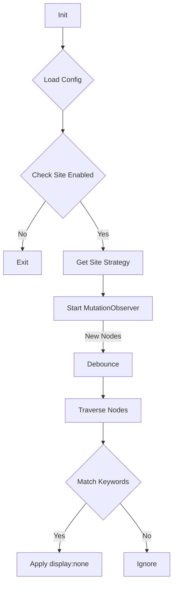

# 模块设计规格书 (Module Design Specification)

## 模块 1: ConfigManager (Settings)

### 1. 概述
*   **对应 FR**: FR1 (管理用户配置)
*   **职责**: 负责加载、保存和提供用户配置（关键词、站点开关）。
*   **类型**: IO Wrapper + Data Structure

### 2. 数据结构定义 (Immutable)

```typescript
type FilterConfig = {
    readonly keywords: ReadonlyArray<string>;
    readonly siteRules: ReadonlyMap<string, boolean>; // Host -> Enabled
};

type StorageInterface = {
    load(): Promise<FilterConfig>;
    save(config: FilterConfig): Promise<void>;
}
```

### 3. 函数接口与契约 (Contracts)

#### Function: `isSiteEnabled`
*   **Signature**: `(config: FilterConfig, hostname: string) -> boolean`
*   **Side Effects**: None

**契约**:
*   **Requires**: `hostname` 不为空。
*   **Ensures**: 如果 `hostname` 在白名单且值为 true，返回 true；否则根据默认策略返回。

---

## 模块 2: SiteStrategy (Targeting)

### 1. 概述
*   **对应 FR**: FR3.1 (解析站点策略)
*   **职责**: 为不同网站提供标准化的元素查找和处理规则。
*   **类型**: Strategy Pattern (Object Dictionary)

### 2. 数据结构定义

```typescript
type SiteStrategy = {
    readonly hostPattern: RegExp | string; // 匹配的域名
    readonly containerSelector: string;    // 推文/视频卡片的 CSS 选择器
    readonly textSelector: string;         // 包含文本的子元素选择器 (相对 container)
};
```

---

## 模块 3: Matcher (Logic)

### 1. 概述
*   **对应 FR**: FR3.2 (文本匹配)
*   **职责**: 判断给定文本是否命中关键词列表。
*   **类型**: Pure Function

### 3. 函数接口与契约

#### Function: `containsKeyword`

*   **Signature**: `(text: string, keywords: string[]) -> boolean`
*   **Side Effects**: None

**契约**:
*   **Ensures**:
    *   Result is `true` if any keyword is a substring of `text` (case-insensitive).
    *   Result is `false` if `keywords` is empty or `text` is empty.

---

## 模块 4: FilterApp (Orchestrator)

### 1. 概述
*   **对应 FR**: FR2, FR3 (流程控制)
*   **职责**: 串联配置、监听器和处理器，运行主循环。
*   **类型**: Controller

### 3. 主要流程 (Workflow)


